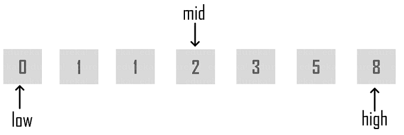

# Algorithm and Data Structures

## Binary Search

> **"Binary search is an efficient algorithm for finding an item from a sorted list of items. It works by repeatedly dividing in half the portion of the list that could contain the item, until you've narrowed down the possible locations to just one."**

Binary search runs in logarithmic time in the worst case, making O(log n) comparisons, where n is the number of elements in the array.

This implementation is in `Python, in it recursive and iterative method`. The code shows a good steppings of the program at each point in the terminal, for clarity and good unserstanding.
